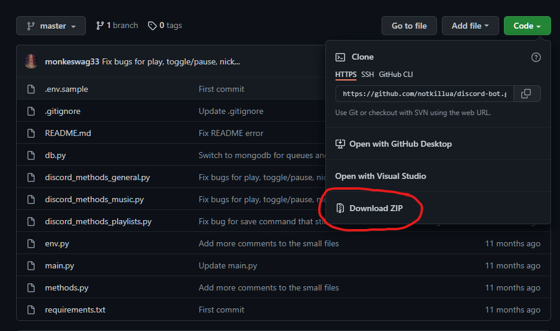
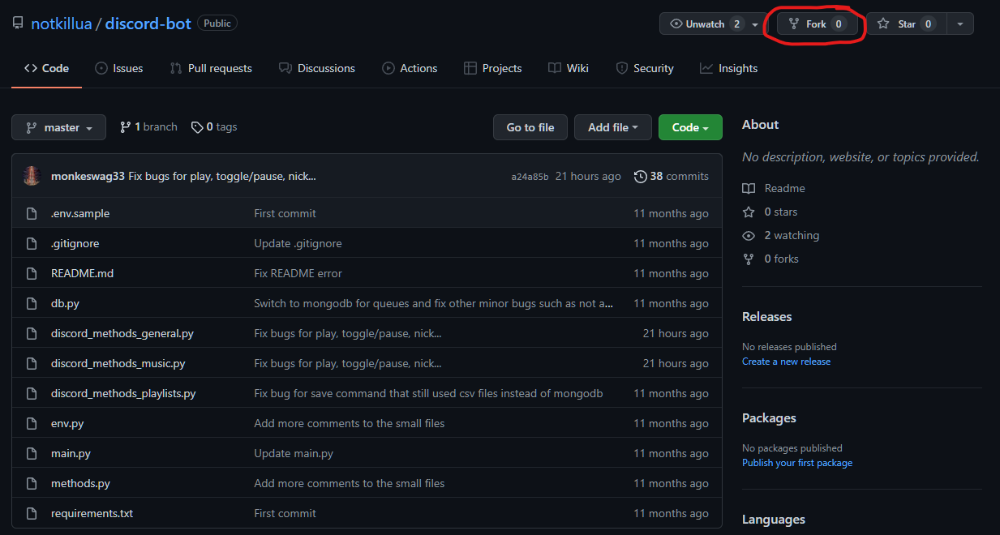

# Musical
## Description
Musical is a discord bot that will play music in voice channels.<br>
Musical has many commands for adding, moving, deleting for queues and playlists.
## Technology
Discord library: discord.py<br>
Queues, Playlists, and Prefixes stored in MongoDB
## How to Run
If you wish to test and run the bot on your own, there are a few steps you need to take:
1. Click the `Download ZIP` under `Code` on the Github repository, or fork the repository


2. Rename the `.env.sample` to `.env`
3. Create a Discord Application at [Discord Developers](https://discord.com/developers/applications) and copy the token from \<Application Name\> -> Bot -> Copy<br>
If you are creating an official bot, please creating one bot for developement and one for production. This way users will not encounter bugs while you are working on a feature.
4. Open the .env file and replace the `PROD_TOKEN=Discord token here (production)` with `PROD_TOKEN=` and the copied token.<br>Example: `PROD_TOKEN=###########################################################`<br>
If you only created one bot, paste the same token for `DEV_TOKEN=`, otherwise use the developement bot token.
5. Go to [Genius Developers](https://genius.com/developers) and `Create an API Client`
6. Generate a Client Access Token and copy it
7. Open the .env file and change `GENIUS_ACCESS_TOKEN=Genius token here` to `GENIUS_ACCESS_TOKEN=` and the copied access token.<br>Example: `GENIUS_ACCESS_TOKEN=################################################################`
8. Create a MongoDB cluster on your local machine or on Mongodb Atlas.<br>
Copy the uri from MongoDB Atlas or create a uri from your local MongoDB cluster
MongoDB Atlas uri will look something like: `mongodb+srv://<username>:<password>@cluster0.6byrp.mongodb.net/myFirstDatabase?retryWrites=true&w=majority`
A local MongoDB uri will look something like: `mongodb://localhost:27017`
9. Replace the `MONGO_URI=Mongo uri here` with `MONGO_URI=` and your MongoDB uri.<br>
Example: `MONGO_URI=mongodb://localhost:27017`
10. The python dependencies is located in `requirements.txt`. Install the dependencies with `pip install -r requirements.txt`<br>
If you get an error like `pip: command not found`, try replacing `pip` with `pip3`, otherwise pip/pip3 might not be installed
10. Now you can finally run the bot. To run the bot in with the production token, run
    ```bash
    python main.py prod
    ```
    Developement mode:
    ```bash
    python main.py dev
    ```
    If you get an error like `python: command not found`, try replacing `python` with `python3`<br>
    Please note that python 3.5.3 and higher is required to run the bot.
## Commands
### General
| Command | Description             |
| :-----: | :---------------------: |
| hello   | Says hello              |  
| nick    | Changes nickname of bot |
| prefix  | Change prefix           |
### Music
| Command | Description                      |
| :-----: | :------------------------------: |
| add     | Adds song to queue               |
| join    | Joins video channel              |
| leave   | Leaves voice channel             |
| loop    | Loop queue                       |
| lyrics  | Show lyrics of song              |
| move    | Move video in queue              |
| place   | Go to specific song in the queue |
| play    | Plays song                       |
| queue   | Show queue                       |
| remove  | Removes song                     |
| clear   | Removes all songs in queue       |
| skip    | Skip current song                |
| status  | Show status of bot               |
| stop    | Stops video                      |
| pause   | Toggles state of video           |
| song    | Gives current song               |
### Playlist
| Command   | Description                        |
| :-------: | :--------------------------------: |
| load      | Load playlist videos into queue    |
| padd      | Add video to playlist              |
| pcreate   | Create playlist                    |
| playlist  | Get the current playlist           |
| playlists | Show playlists                     |
| pmove     | Move videos in playlist            |
| pqueue    | Show queue of playlist             |
| premove   | Remove video from playlist         |
| pclear    | Remove all videos from playlist    |
| premovep  | Remove playlist                    |
| prename   | Rename playlist                    |
| pset      | Set current playlist               |
| save      | Save current queue to the playlist |
### No Category
| Command | Description        |
| :-----: | :----------------: |
| help    | Shows all commands |